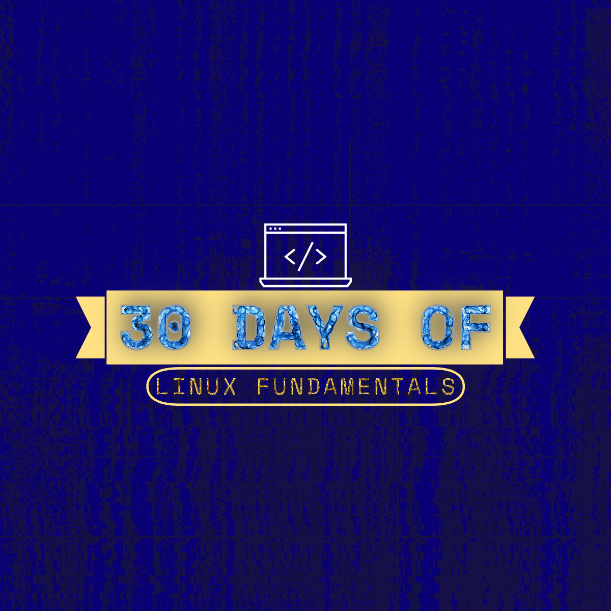

# 30 Days of Linux Fundamentals



# Added Control Panel!!

**In the root directory of 30-Days-Of-Linux-Fundamentals run**
```bash
./control-panel
```
**And choose the week, day, and lesson accordingly. At the end of each lesson while using the control-panel app you will be returned to the main menu**

## Introduction

Welcome to the **30 Days of Linux Fundamentals** program! This self-paced course is designed to take you on a journey from beginner to advanced levels of Linux proficiency over four and a half weeks. Whether you're completely new to Linux or have some prior knowledge, this course is structured to enhance your understanding and skills in Linux.

## Course Overview

### Structure

- **Duration**: 4.5 weeks
- **Pacing**: Self-paced
- **Daily Breakdown**:
  - **Breakfast**: Morning study guide and tasks
  - **Lunch**: Midday study guide and tasks
  - **Dinner**: Evening study guide and tasks

Each day is divided into three parts—Breakfast, Lunch, and Dinner—to ensure a steady and manageable learning pace.

### Requirements for Linux Setup

- **No Prior Linux Experience Required**: Although familiarity with Linux or basic tech knowledge is beneficial, it is not required.
- **Recommended Setup**:
  - **Operating System**: CentOS, or any Linux distribution of your choice.
  - **Environment**: VirtualBox, VMware, or USB drive.

### Getting Started

To begin the course, you'll need to set up your Linux environment. You can do this using a virtual machine such as VirtualBox or VMware, or by running Linux directly from a USB drive. Below are step-by-step instructions for both options, and several Linux distributions to choose from.

#### Setting Up VirtualBox

1. **Download VirtualBox**: [VirtualBox Downloads](https://www.virtualbox.org/wiki/Downloads)
2. **Choose a Linux Distribution**: Below are some common choices:
   - **CentOS**: [CentOS Downloads](https://www.centos.org/download/)
   - **Ubuntu**: [Ubuntu Downloads](https://ubuntu.com/download)
   - **Kali Linux**: [Kali Linux Downloads](https://www.kali.org/get-kali/)
   - **Arch Linux**: [Arch Downloads](https://archlinux.org/download/)
   - **Linux Mint**: [Linux Mint Downloads](https://linuxmint.com/download.php)
   - **Parrot OS**: [Parrot OS Downloads](https://parrotsec.org/download/)
   - **Manjaro**: [Manjaro Downloads](https://manjaro.org/download/)

3. **Create a Virtual Machine**:
   - **Download your Linux ISO**.
   - **Open VirtualBox**, click **New** to create a new virtual machine.
   - **Specify the Linux ISO file** during the setup.
   - Set configurations for:
     - **Storage**: Minimum 20GB.
     - **RAM**: Allocate between 2GB and 16GB (based on your physical RAM).
     - **CPU**: Allocate 2-4 cores.
   - **Start the VM** to install and use your Linux distribution.

4. **Guides for Installation**:
   - [CentOS Installation Guide](https://linuxsimply.com/linux-basics/os-installation/virtual-machine/centos-7-on-virtualbox/)
   - [General VirtualBox Setup Video Tutorial](https://www.youtube.com/watch?v=aMRVcjpJDjg)

#### Setting Up VMware

1. **Download VMware Workstation Player**: [VMware Downloads](https://www.vmware.com/products/workstation-player/workstation-player-evaluation.html)
2. **Create a Virtual Machine**:
   - **Download your Linux ISO** (e.g., CentOS, Ubuntu, Kali, etc.).
   - **Open VMware**, click **Create a New Virtual Machine**.
   - **Select Installer Disc Image File (ISO)** and locate the downloaded Linux ISO.
   - Set the same configurations as for VirtualBox:
     - **Storage**: Minimum 20GB.
     - **RAM**: Allocate between 2GB and 16GB.
     - **CPU**: Allocate 2-4 cores.
   - **Finish setup** and **start your virtual machine**.

3. **Guides for Installation**:
   - [VMware Setup Documentation](https://www.vmware.com/support.html)
   - [Video Tutorial for Linux Setup on VMware](https://www.youtube.com/watch?v=ecFegHHg3DI)

#### Running Linux from a USB Drive

If you'd prefer to run Linux natively from your hardware without installing it, you can use a USB drive.

1. **Download Your Linux ISO**: Choose a Linux distribution from the list above.
2. **Create a Bootable USB**: You can use tools like [Rufus](https://rufus.ie/) or [Etcher](https://www.balena.io/etcher/).
3. **Instructions for Bootable USB**:
   - **Etcher Tutorial**: [How to Create Bootable USB Using Etcher](https://linuxize.com/post/how-to-create-a-bootable-centos-7-usb-stick/)
   - **Video Guide for Etcher**: [Etcher Bootable USB Video](https://www.youtube.com/watch?v=_TbYxImJO44)
   - **Rufus Tutorial**: [How to Create Bootable USB Using Rufus](https://www.wikihow.com/Boot-Linux-from-a-USB-on-Windows-10)
   - **Video Guide for Rufus**: [Rufus Bootable USB Video](https://www.youtube.com/watch?v=esBXfD3yuCE)
4. **Boot From USB**: Restart your computer and access the boot menu (usually by pressing `F12` or `Esc` during startup). Select your USB drive and start Linux.

### Tips for Choosing a Linux Distribution

- **CentOS**: Suitable for server and stability-focused environments. Great for learning enterprise Linux.
- **Ubuntu**: A beginner-friendly option with a large community and great support.
- **Kali Linux**: Preferred by security professionals for penetration testing.
- **Arch Linux**: A rolling-release distro that gives you complete control, but is more advanced.
- **Linux Mint**: A user-friendly desktop-focused distro for those new to Linux.
- **Parrot OS**: An alternative to Kali for penetration testing, with more focus on usability.
- **Manjaro**: A good Arch-based system that is easier to use, with a focus on user-friendliness.

### General Troubleshooting Tips

- **VirtualBox Issues**: Ensure that **hardware virtualization** (VT-x or AMD-V) is enabled in your BIOS settings.
- **Low Performance**: Increase RAM or CPU cores allocated to your virtual machine.
- **Boot Issues from USB**: Confirm that the ISO was correctly written to the USB, and double-check BIOS/UEFI settings to enable USB booting.

These instructions should help you set up a Linux environment that fits your needs, whether it's virtual or running directly from your hardware.

## How to Use This Course

Each day's study guides are divided into Breakfast, Lunch, and Dinner sections, ensuring comprehensive coverage of Linux fundamentals.

### Running Lessons Per Day

To run the lesson for each meal, use the following commands in your terminal:


1. cd 30-Days-Of-Linux
2. cd week-*
3. cd day*
4. cd day-*-food
5. ./breakfast-day-*
6. ./lunch-day-*
7. ./dinner-day-*

**Replace * with the day number (e.g., cd day01, cd day-01-food, ./breakfast-day-01).**

To run the study guide for each meal, use the following commands in your terminal:

1. cd 30-Days-Of-Linux
2. cd week-*
3. cd day*
4. cd day-*-study-guides
5. cat day-*-breakfast-guide
6. cat day-*-lunch-guide
7. cat day-*-dinner-guide

**Replace * with the day number (e.g., cd day01, cd day-01-study-guides, cat day-01-breakfast-guide).**

## Table of Contents

**For a complete reference of the course content, refer to the linux-30day-journey.md file in the root directory.**
Example Table of Contents

Week 1

Day 1: Getting Started

    Breakfast
    Lunch
    Dinner

Day 2: File Management

    Breakfast
    Lunch
    Dinner

...

Week 2: Intermediate Commands and Scripting
...

Week 3: Advanced Topics
...

Week 4: System Administration
...

Final Days: Comprehensive Review and Projects
Additional Resources

#### For further reading and resources, check out the following topics:

- [Linux Documentation](https://www.kernel.org/doc/html/latest/)
- [CentOS Wiki](https://wiki.centos.org/)
- [Linux Command Line Basics](https://linuxjourney.com/)

<p>Embark on this exciting journey and become proficient in Linux over the next 30 days. Let's get started!</p>
